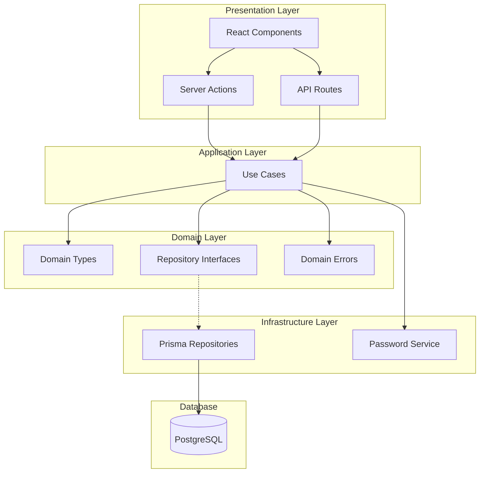

# Task Manager Web App

A clean architecture task management application built with Next.js, featuring authentication, CRUD operations, and task filtering.

## 🎬 Showcase

Watch the application demo: [Demo Video](https://www.loom.com/share/44360ad9aef1482d9237a855467a4f55?from_recorder=1&focus_title=1)

## 🏗️ Architecture



## 📁 Project Structure

```
src/
├── app/                    # Next.js App Router
│   ├── actions/           # Server actions
│   ├── api/               # API routes
│   ├── signin/            # Sign in page
│   ├── signup/            # Sign up page
│   └── tasks/             # Task pages
├── components/             # React components
│   └── ui/                # Shadcn UI components
├── domain/                 # Business logic layer
│   ├── types.ts           # Domain types
│   ├── repositories.ts    # Repository interfaces
│   ├── usecases.ts        # Use case interfaces
│   └── errors.ts          # Domain errors
├── repositories/           # Data access layer
│   └── prisma/            # Prisma implementations
├── usecases/              # Use case implementations
├── services/              # External services
└── auth/                  # Auth configuration
```

## 🛠️ Technical Choices

### Frontend

- **Next.js 16** with App Router - React framework with server components
- **Shadcn UI** - Accessible component library
- **Tailwind CSS** - Utility-first styling
- **React Hook Form** + **Zod** - Form validation

### Backend

- **Clean Architecture** - Separation of concerns via layers
- **Prisma** - Type-safe ORM
- **PostgreSQL** - Relational database
- **NextAuth** - Authentication

### Development

- **TypeScript** - Type safety
- **Vitest** - Testing framework
- **ESLint** + **Prettier** - Code quality
- **Husky** + **lint-staged** - Git hooks
- **Docker** - Containerization

## 🚀 Getting Started

### Prerequisites

- Node.js 18+
- pnpm (or npm/yarn)
- Docker (optional)

### Local Development

1. **Install dependencies**

   ```bash
   pnpm install
   ```

2. **Start PostgreSQL**

   ```bash
   docker-compose up -d db
   ```

3. **Set up environment variables**

   ```bash
   cp .env.example .env
   # Edit .env with your DATABASE_URL and NEXTAUTH_SECRET
   ```

4. **Run migrations**

   ```bash
   pnpm prisma migrate dev
   ```

5. **Seed database** (optional)

   ```bash
   pnpm db:seed
   ```

6. **Start development server**

   ```bash
   pnpm dev
   ```

   Open [http://localhost:3000](http://localhost:3000)

### Docker

```bash
docker-compose up
```

Access the app at [http://localhost:3000](http://localhost:3000)

### Available Scripts

- `pnpm dev` - Start development server
- `pnpm build` - Build for production
- `pnpm start` - Start production server
- `pnpm test` - Run tests
- `pnpm lint` - Run linter
- `pnpm db:studio` - Open Prisma Studio
- `pnpm db:seed` - Seed database

## 🧪 Testing

```bash
pnpm test              # Run tests
pnpm test:ui           # Run tests with UI
pnpm test:coverage     # Generate coverage report
```

## 📝 License

MIT
